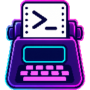
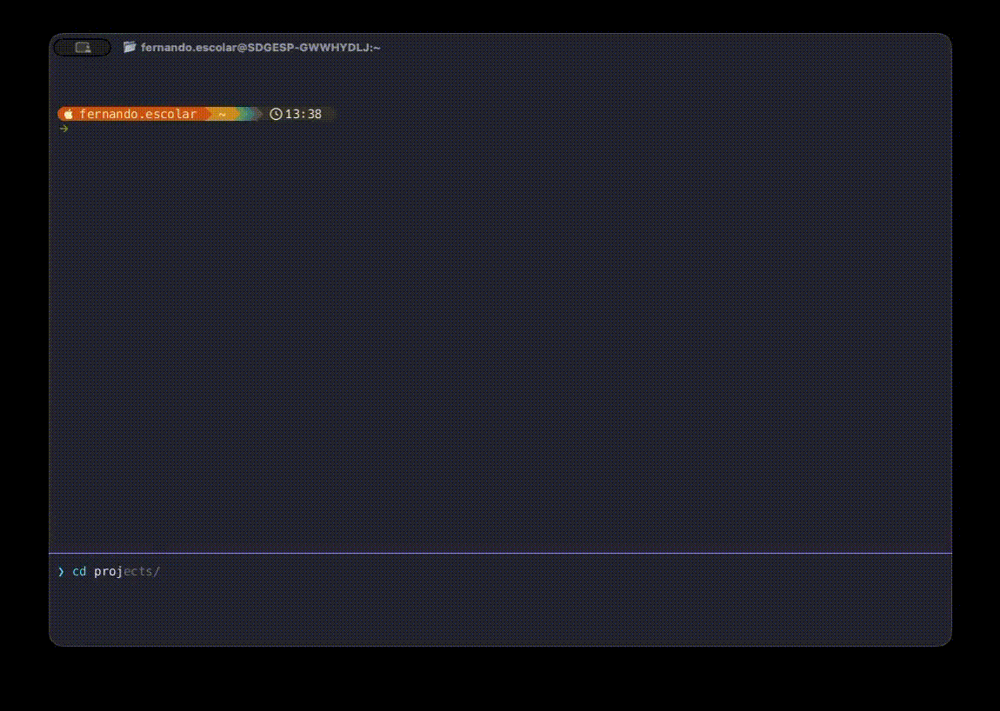

# Teletipo

A terminal emulator written in Rust — GPU-accelerated, multi-tab, with a code-editor-style command input.



## Install

### Quick install (recommended)

**macOS / Linux**

```bash
curl -fsSL https://github.com/fernandoescolar/teletipo/releases/latest/download/install.sh | sh
```

The macOS installer defaults to a desktop `.app` bundle. Pass `--no-desktop` for a CLI-only binary.

**Windows (PowerShell)**

```powershell
irm https://github.com/fernandoescolar/teletipo/releases/latest/download/install.ps1 | iex
```

### Build from source

```bash
git clone https://github.com/fernandoescolar/teletipo.git
cd teletipo
cargo build --release
# binary at target/release/teletipo
```

### Platform archives

| File | Platform |
|---|---|
| `teletipo-macos-universal.tar.gz` | macOS CLI (arm64 + x86-64) |
| `teletipo-macos-app.tar.gz` | macOS app bundle |
| `teletipo-linux-x86_64.tar.gz` | Linux x86-64 |
| `teletipo-windows-x86_64.zip` | Windows x86-64 |

Each archive includes `install.sh` / `install.ps1` and the matching uninstall script.

---

## Recommended setup

For the best experience, install a [Nerd Font](https://www.nerdfonts.com/font-downloads) (e.g. Hack Nerd Font) and set it as the font in Teletipo's settings. Optionally, pair it with [Starship](https://github.com/starship/starship) for a rich prompt:

```bash
starship preset gruvbox-rainbow -o ~/.config/starship.toml
```

---

## Usage

```bash
teletipo                        # open a shell in the current directory
teletipo --exec "htop"          # run a specific command on startup
teletipo --renderer wgpu        # use the wgpu backend instead of glow
teletipo --metrics              # expose Prometheus metrics on 127.0.0.1:9898
TELETIPO_RENDERER=wgpu teletipo # select renderer via environment variable
```

Runtime logs are written to daily-rotated files under the platform data directory (see [File Locations](#file-locations)).

---

## Features

### Terminal

- GPU-accelerated rendering (glow backend by default, wgpu available via `--renderer wgpu`)
- Full ANSI/VT100 support — primary and alternate screen buffers, SGR colors, DEC sequences, scrollback
- Multi-tab workflow with tab reordering, middle-click to close, and per-tab unread/bell badges
- Themeable with YAML theme files — ships with Catppuccin Mocha, Dracula, Gruvbox, Nord, One Dark, Rosé Pine, Solarized Dark, Tokyo Night
- Visual BEL flash (configurable)

### Command input

Teletipo replaces the standard terminal input line with a small code editor:

- Block cursor, undo/redo, multi-line input (`Shift+Enter`)
- Command history with frecency-ranked autocomplete — press `Tab` to open a suggestion dropdown, ghost text previews the top match
- While a command runs the editor dims; press `Ctrl+N` to unlock it early and prepare the next command
- After any command that takes ≥ 1 second, an overlay shows the elapsed time and exit status (`3.0s [ok]` / `12s [!!]`) for 4 seconds

### Navigation & search

- **Prompt navigation** — `Jump to Previous/Next Prompt` in the command palette jumps through shell prompts in the scrollback
- **Inline search** — `Cmd+F` opens a search panel with regex support, match count, and next/previous navigation; searches both visible rows and full scrollback
- **Font zoom** — `Cmd++` / `Cmd+-` resize the font on the fly; `Cmd+0` resets to default

### Links & file paths

- **OSC 8 hyperlinks** — links emitted by `ls --hyperlink`, `bat`, `delta`, `eza`, etc. render with an underline; click to open with your OS default handler
- **File path detection** — paths like `src/main.rs:42` in terminal output are underlined when `Cmd` is held; `Cmd+click` opens the file in `$EDITOR` at the correct line (supports vim/nvim, emacs, helix, nano, micro, kate), falling back to the OS default handler

### SSH integration

- SSH hosts defined in `~/.ssh/config` appear automatically in the command palette as `SSH → hostname` entries — no extra configuration needed
- Select `SSH → Nueva conexión…` to connect to any host not in your config by typing a destination (`user@host`, `user@host -p 2222`, etc.)
- Each SSH connection opens in a new tab

### Shell integration

Teletipo automatically injects OSC 133 and OSC 7 hooks into **zsh** and **bash** — no manual shell config required. These hooks power:

- Prompt boundary detection (used by prompt navigation and the accessibility tree)
- Per-command exit code tracking
- Tab working directory label (`OSC 7`)

For other shells, you can add the hooks manually — see `crates/terminal-pty/src/session.rs` for the exact sequences.

### Completions

The suggestion dropdown combines multiple sources, ranked by frecency:

- **History** — full prefix matches and last-token matches against your command history
- **Shell-native completions** — live context-aware completions: `git` branches, tags, and remotes; `ssh` hosts from `~/.ssh/config` and `known_hosts`; `docker`/`podman` container and image names; when using **fish**, all fish completions are available (kubectl, cargo, npm, etc.)
- **Filesystem paths** — triggered by `/`, `./`, `../`, `~`, or any `cd` argument
- **Man-page flags & subcommands** — fetched asynchronously from `man` and `--help` output

### Other

- **Command palette** (`Cmd+Shift+P`) — tab management, theme/font switching, settings, prompt navigation, SSH connections, and more; filterable by typing
- **Right-click context menus** — tabs, terminal pane, and editor each have their own context menu
- **Drag and drop** — drop a `*.yaml` file to apply a theme; drop any other file to paste its path into the editor
- **Screen reader support** — VoiceOver (macOS) and Orca (Linux via speech-dispatcher/espeak); announcements fire on each completed command
- **Auto-update** — checks GitHub Releases on launch, downloads and replaces the binary silently; shows an overlay when ready; `teletipo update rollback` reverts to the previous binary
- **Session restore** — tabs, terminal output, and command history are restored on next launch; session is also autosaved every 5 minutes while the app is open (configurable)
- **Kitty keyboard protocol** — when an app requests it (e.g. Neovim, Helix), keys are encoded in kitty CSI u format so modifiers and key-up events are fully disambiguated
- **Command finish notifications** — OS notification when a long-running command completes while the window is unfocused (opt-in via `notify_on_command_secs` in config)
- **Custom keybindings** — remap any action to a key combo in `config.toml`

---

## Keyboard Shortcuts

> On macOS use `Cmd`; on Linux/Windows use the equivalent `Super`/`Win` or `Ctrl` key noted below.

### Tabs

| Shortcut | Action |
|---|---|
| `Cmd+T` / `Ctrl+T` | New tab |
| `Cmd+W` / `Ctrl+W` | Close current tab |
| `Cmd+[` / `Ctrl+PageUp` | Previous tab |
| `Cmd+]` / `Ctrl+PageDown` | Next tab |
| `Cmd+1–9` / `Ctrl+1–9` | Jump to tab N |

### Font zoom

| Shortcut | Action |
|---|---|
| `Cmd++` / `Cmd+=` | Increase font size by 1 pt |
| `Cmd+-` | Decrease font size by 1 pt |
| `Cmd+0` | Reset to default size |

### Command input

| Shortcut | Action |
|---|---|
| `Enter` | Submit command |
| `Shift+Enter` | Insert newline (multi-line) |
| `Ctrl+N` | Unlock editor while a command is running |
| `↑` / `↓` | Navigate command history (or move cursor in multi-line input) |
| `Cmd+Z` / `Ctrl+Z` | Undo |
| `Cmd+Shift+Z` / `Ctrl+Y` | Redo |
| `Home` / `End` | Jump to start / end of input |
| `Shift+←/→` | Extend selection |

### Autocomplete

| Shortcut | Action |
|---|---|
| `Tab` | Open suggestion popup / confirm selection |
| `Shift+Tab` | Cycle backward through suggestions |
| `↑` / `↓` | Navigate the suggestion list |
| `Enter` | Confirm and submit |
| `Escape` | Dismiss popup |

### Copy & paste

| Shortcut | Action |
|---|---|
| `Cmd+C` / `Ctrl+Shift+C` | Copy terminal or editor selection |
| `Cmd+V` / `Ctrl+Shift+V` | Paste from clipboard |

### Search

| Shortcut | Action |
|---|---|
| `Cmd+F` / `Ctrl+F` | Open search panel |
| `Enter` / `↓` | Next match |
| `↑` | Previous match |
| `Escape` | Close search panel |

### Command palette

| Shortcut | Action |
|---|---|
| `Cmd+Shift+P` / `Ctrl+Shift+P` | Open command palette |
| `↑` / `↓` | Move through items |
| `Enter` | Execute selected item |
| `Escape` | Close palette |
| typing | Filter items live |

### Mouse

| Action | Effect |
|---|---|
| Click + drag in terminal | Select text |
| `Cmd+click` on a path / link | Open file in `$EDITOR` or browser |
| Drag the split divider | Resize terminal / editor pane |
| Drag the scrollbar | Scroll terminal or editor |
| Middle-click a tab | Close that tab |
| Right-click a tab | Tab context menu |
| Right-click in terminal | Terminal context menu |
| Right-click in editor | Editor context menu |
| Click the scroll activity badge | Jump to bottom of scrollback |
| Drop a `*.yaml` file on the window | Apply theme immediately |
| Drop any other file | Paste path into editor |

### Terminal control

| Shortcut | Sends |
|---|---|
| `Ctrl+A–Z` | `^A`–`^Z` |
| `Ctrl+[` | `ESC` |
| `Escape` | `ESC` (or dismiss popup/palette) |

---

## Settings

Open the settings panel with `Cmd+,` (or `Ctrl+,`). Changes are saved automatically when you close with `Escape`.

### Navigation

| Key | Action |
|---|---|
| `↑` / `↓` | Move focus between fields |
| `←` / `→` | Cycle values / increment numeric fields |
| `Enter` | Edit field or open search for selectors |
| `Escape` | Close panel / cancel current edit |

### Fields

| Field | Default | Description |
|---|---|---|
| `theme` | `tokyo-night` | Active color theme. `←`/`→` to cycle, `Enter` to search by name. |
| `font › size` | `14` | Font size in points. `←`/`→` in steps of 0.5, or `Enter` to type directly. |
| `font › family` | *(system default)* | Font family. `←`/`→` to cycle, `Enter` to search. |
| `padding › horizontal` | `8` | Horizontal padding in pixels. |
| `padding › vertical` | `8` | Vertical padding in pixels. |
| `terminal › shell` | *(auto)* | Shell executable path. Empty = use `$SHELL`. |
| `terminal › scrollback_lines` | `10000` | Scrollback buffer size. `←`/`→` in steps of 500. |
| `terminal › bell` | `on` | Enable/disable the visual bell flash. `←`/`→` to toggle. |
| `terminal › restore_session` | `on` | Restore tabs and output from the previous session on launch; autosaves every 5 min. `←`/`→` to toggle. |
| `terminal › notify_on_command_secs` | `0` | Send an OS notification when a command runs longer than this many seconds and the window is not focused. `0` = disabled. |

### Config file

Settings are persisted in `config.toml` (see [File Locations](#file-locations)). You can edit it directly — changes apply on next launch.

```toml
[font]
size   = 14.0
family = "Hack Nerd Font"   # omit to use the system default

[padding]
horizontal = 8
vertical   = 8

[terminal]
shell                  = ""     # empty = $SHELL default
scrollback_lines       = 10000
bell                   = true
restore_session        = true
notify_on_command_secs = 10     # 0 = disabled

active_theme = "tokyo-night"

# Custom keybindings — add as many [[keybindings]] blocks as you like.
# Modifier names: "Cmd" (macOS) / "Ctrl" / "Shift" / "Alt"
# Action names: new_tab, close_tab, move_tab_left, move_tab_right,
#   open_settings, open_command_palette, copy, paste, clear,
#   zoom_in, zoom_out, jump_to_prev_prompt, jump_to_next_prompt
#
# [[keybindings]]
# key       = "t"
# modifiers = ["Cmd"]
# action    = "new_tab"
#
# [[keybindings]]
# key       = "k"
# modifiers = ["Cmd"]
# action    = "clear"
```

---

## Themes

Teletipo ships with: Catppuccin Mocha, Dracula, Gruvbox, Nord, One Dark, Rosé Pine, Solarized Dark, Tokyo Night.

To add a custom theme, drop a `*.yaml` file into the `themes/` config directory — it will appear in the settings panel immediately. You can also drag a theme file onto the window to apply it on the spot. See the bundled theme files for the format reference.

---

## File Locations

| What | File | macOS | Linux | Windows |
|---|---|---|---|---|
| Configuration | `config.toml` | `~/Library/Application Support/teletipo/` | `~/.config/teletipo/` | `%APPDATA%\teletipo\` |
| Custom themes | `themes/*.yaml` | `~/Library/Application Support/teletipo/themes/` | `~/.config/teletipo/themes/` | `%APPDATA%\teletipo\themes\` |
| Session & history | `session.json` | `~/Library/Application Support/teletipo/` | `~/.local/share/teletipo/` | `%LOCALAPPDATA%\teletipo\` |
| Logs | `logs/teletipo.log.YYYY-MM-DD` | `~/Library/Application Support/teletipo/logs/` | `~/.local/share/teletipo/logs/` | `%LOCALAPPDATA%\teletipo\logs\` |

---

## Development

```bash
cargo test --workspace          # run all tests
make ci                         # fmt + clippy + tests
cargo run                       # run from source
cargo run -- --exec "htop"

cargo bench -p terminal-ansi   # parser benchmarks
cargo bench -p terminal-screen  # screen model benchmarks
```

### Workspace layout

| Crate | Purpose |
|---|---|
| `src/main.rs` | Binary entry point |
| `crates/app-cli` | Application runtime — window, tabs, input routing, themes, updater |
| `crates/app-orchestrator` | Wires terminal, editor, and PTY pump loop |
| `crates/editor-core` | Editor buffer and undo/redo |
| `crates/editor-lang` | Token-based syntax highlighting |
| `crates/platform-abstraction` | Clipboard, window control, accessibility, IME |
| `crates/render-glow` | Default renderer (`winit + glutin + glow`) |
| `crates/render-wgpu` | WGPU renderer backend and shared snapshot types |
| `crates/terminal-ansi` | ANSI/VT parser |
| `crates/terminal-screen` | Screen grid, styles, scrollback, damage tracking |
| `crates/terminal-core` | Applies parser actions to the screen |
| `crates/terminal-pty` | PTY session management |
| `crates/ui` | Shared UI input/state primitives |

### Release builds

Requires [`cross`](https://github.com/cross-rs/cross) and Docker for Linux/Windows targets.

```bash
cargo install cross

make release           # all platforms
make release-macos     # macOS universal binary
make release-linux     # Linux x86-64
make release-windows   # Windows x86-64
```

Artifacts land in `dist/`.
