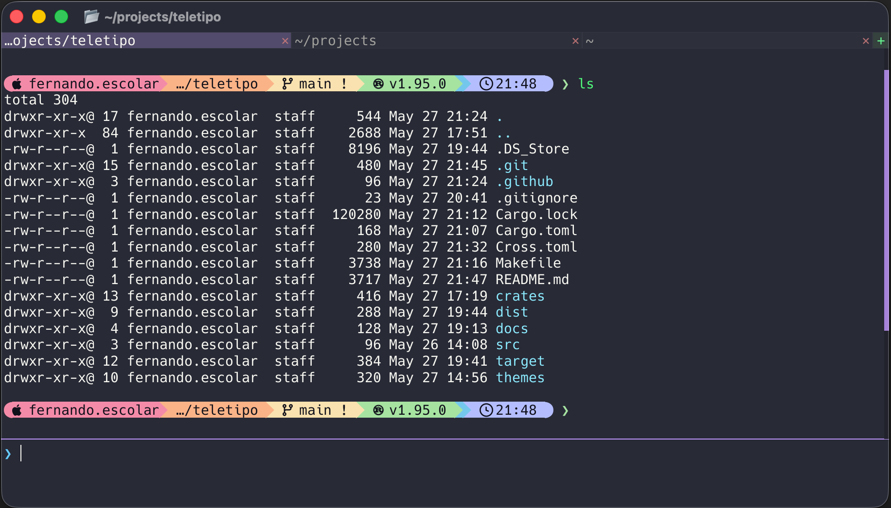

# Teletipo

A modern terminal emulator written in Rust — GPU-accelerated, multi-tab, with rich color support and a code-editor-like command input.



## Install

### macOS (Apple Silicon + Intel universal binary)

```bash
curl -Lo teletipo.tar.gz https://github.com/fernandoescolar/teletipo/releases/latest/download/teletipo-macos-universal.tar.gz
tar -xzf teletipo.tar.gz
sudo mv teletipo /usr/local/bin/
```

### Linux (x86-64)

```bash
curl -Lo teletipo.tar.gz https://github.com/fernandoescolar/teletipo/releases/latest/download/teletipo-linux-x86_64.tar.gz
tar -xzf teletipo.tar.gz
sudo mv teletipo /usr/local/bin/
```

### Windows (x86-64)

Download `teletipo-windows-x86_64.zip` from the [latest release](https://github.com/fernandoescolar/teletipo/releases/latest), extract it, and place `teletipo.exe` somewhere on your `PATH`.

### Build from source

```bash
git clone https://github.com/fernandoescolar/teletipo.git
cd teletipo
cargo build --release
# binary at target/release/teletipo
```

## Auto-update

Teletipo updates itself automatically. Every time it launches, a background thread checks GitHub Releases for a newer version. If one is found the new binary is downloaded and replaces the current one silently — no prompts, no flags. When the update is complete a brief overlay appears in the terminal window:

```
Updated to vX.Y.Z — restart to apply
```

Simply close and reopen Teletipo to start using the new version.

> The update check is non-blocking: the terminal is fully usable while the download happens in the background. If the check fails (no network, GitHub unreachable, etc.) the app starts normally with no error.

## Usage

```bash
# Open a shell in the current directory
teletipo

# Run a specific command on startup
teletipo --exec "htop"
```

## Features

- GPU-accelerated rendering via `wgpu`
- Multi-tab workflow
- Stateful ANSI/VT100 parser (CSI, DEC sequences, SGR, alternate screen, scrollback)
- Primary and alternate screen buffers
- Code-editor-style command input
- Themeable (YAML theme files, ships with Catppuccin Mocha, Dracula, Gruvbox, Nord, One Dark, Rosé Pine, Solarized Dark, Tokyo Night)
- Automatic silent self-update from GitHub Releases

## Keyboard Shortcuts

> `Cmd` on macOS · `Super`/`Win` on Linux/Windows

### Tabs

| Shortcut | Action |
|---|---|
| `Cmd + T` | New tab |
| `Cmd + W` | Close current tab |
| `Cmd + [` | Previous tab |
| `Cmd + ]` | Next tab |
| `Cmd + 1 – 9` | Jump to tab N |

### Command input (editor)

| Shortcut | Action |
|---|---|
| `Enter` | Submit command |
| `Shift + Enter` | Insert newline (multi-line input) |
| `↑` / `↓` | Navigate command history (when cursor is on first/last line) |
| `↑` / `↓` | Move cursor up/down in multi-line input |
| `←` / `→` | Move cursor left/right |
| `Shift + ← / →` | Extend selection |
| `Home` | Jump to start of input |
| `End` | Jump to end of input |
| `Backspace` | Delete character before cursor |
| `Delete` | Delete character after cursor |

### Copy & paste

| Shortcut | Action |
|---|---|
| `Cmd + C` | Copy terminal selection or editor selection |
| `Cmd + V` | Paste from clipboard |

### Terminal scrollback

| Shortcut | Action |
|---|---|
| `Page Up` | Scroll up 5 lines |
| `Page Down` | Scroll down 5 lines |

### Settings

| Shortcut | Action |
|---|---|
| `Cmd + ,` | Open settings panel |
| `Ctrl + ,` | Open settings panel |

### Terminal control sequences

| Shortcut | Sends |
|---|---|
| `Ctrl + A – Z` | `^A` – `^Z` (control characters) |
| `Ctrl + [` | `ESC` |
| `Escape` | `ESC` |
| `Tab` | Tab (with current editor content forwarded for shell completion) |

### Mouse

| Action | Effect |
|---|---|
| Click + drag in terminal | Select text |
| `Cmd + C` after selection | Copy selection |
| Drag the split divider | Resize terminal / editor pane |
| Drag the scrollbar | Scroll terminal or editor |
| Right-click in terminal | Context menu |

## Workspace Layout

| Crate | Purpose |
|---|---|
| `crates/terminal-ansi` | ANSI/VT parser and action model |
| `crates/terminal-screen` | Screen/grid model, styles, scrollback, damage tracking |
| `crates/terminal-core` | Applies parser actions over screen state |
| `crates/terminal-pty` | PTY abstractions and session management |
| `crates/editor-core` | Editor buffer and undo/redo |
| `crates/app-orchestrator` | Wires terminal, editor, and PTY pump loop |
| `crates/app-cli` | Application runtime library (GPU window, tabs, themes, updater) |
| `src/main.rs` | Binary entry point |

## Development

```bash
# Run tests
cargo test --workspace

# Run benchmarks
cargo bench -p terminal-ansi
cargo bench -p terminal-screen

# Run from source
cargo run
cargo run -- --exec "printf 'hello\\n'"
```

## Release Builds

A [Makefile](Makefile) builds release artifacts for all platforms. Linux and Windows require [`cross`](https://github.com/cross-rs/cross) and Docker.

```bash
cargo install cross          # one-time setup

make release                 # all platforms
make release-macos           # macOS universal binary
make release-linux           # Linux x86-64
make release-windows         # Windows x86-64
make clean
```

Artifacts land in `dist/`:

| File | Platform |
|---|---|
| `teletipo-macos-universal.tar.gz` | macOS (arm64 + x86-64 lipo'd) |
| `teletipo-linux-x86_64.tar.gz` | Linux x86-64 |
| `teletipo-windows-x86_64.zip` | Windows x86-64 |
